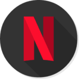
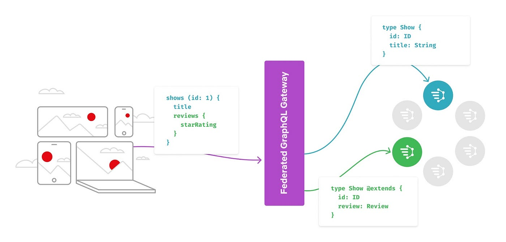

#  Netflix GraphQL Federation Replica



## Introduction

This project demonstrates a simplified replica of Netflix's GraphQL Federation architecture. 
It is designed to integrate data from multiple microservices into a single unified GraphQL API,
providing a scalable and modular approach to data management and retrieval. This setup is particularly 
useful for applications where different teams manage different domains but a unified data query interface is required.

## Project Structure

The project consists of three separate Java modules, each implemented as a Spring Boot 3 application:

* **[Federation Service](federation)**
  The Federation Service acts as the entry point for all GraphQL queries. It serves as the central hub that integrates schemas from the other two services and provides a unified GraphQL schema to the clients. This service fetches data from the Actor and Director services and aggregates them into a cohesive response.

* **[Actor Service](actor-DGS)**
  The Actor Service is responsible for managing and serving data related to actors. It provides a dedicated GraphQL endpoint for retrieving actor information, such as names and surnames. This service operates independently and exposes its own GraphQL API for data retrieval.

* **[Director Service](director-DGS)**
  The Director Service handles data related to directors. Similar to the Actor Service, it offers a dedicated GraphQL endpoint for fetching director details. This service also functions independently and provides its own GraphQL API.


## Architecture Overview

The architecture mimics Netflix's GraphQL Federation, where multiple services with their own schemas and data sources are unified under a single GraphQL gateway. This allows for a seamless integration and querying of diverse data sets.

* Federation Service
Acts as the GraphQL gateway.
Integrates schemas from the Actor and Director services.
Handles complex queries by delegating to the appropriate services.
Aggregates and transforms data from multiple sources into a single response.
* Actor Service
Manages Actor data.
Provides a GraphQL API for querying actor details.
Independent and modular, allowing for easy maintenance and scaling.
* Director Service
Manages Director data.
Exposes a GraphQL API for querying director information.
Functions independently, facilitating isolated development and scaling.

## How It Works

* Client Query: A client sends a GraphQL query to the Federation Service.
* Schema Integration: The Federation Service integrates schemas from the Actor and Director services.
* Data Retrieval: The Federation Service processes the query and makes HTTP GraphQL requests to the Actor and Director services to fetch the necessary data. 
* Data Aggregation: The retrieved data is aggregated and transformed into a unified response.
* Response: The Federation Service sends back the aggregated data to the client.

# Running the Application

Once all services are running, you can test the setup by sending GraphQL queries to the Federation Service.
For example, you can query for actor and director information through a single endpoint.

## Example GraphQL Query

```graphql
query {
  movieById(id: "2") {
    id
    name
    duration
    director {
      id
      firstName
      lastName
    }
    actor {
      id
      name
      surname
    }
  }
}
```