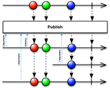
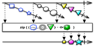
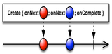
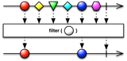
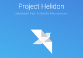
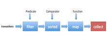

Author Pablo Perez Garcia

Is this repo useful? Please ⭑Star this repository and share the love.

Here we cover with examples the most famous [reactive](https://www.reactivemanifesto.org/) libraries that you can find
in the market.

## ReactiveX

Marble diagrams are not clear enough?.

Here we cover with some practical examples, the most common use of
the [ReactiveX](https://github.com/ReactiveX/RxJava/wiki) platform for Java.

RxScala examples [here](https://github.com/politrons/reactiveScala)

* **Contactable**

  
    * [HotObservable](src/test/java/rx/observables/connectable/HotObservable.java)

* **Combining**

  
    * [Chain](src/test/java/rx/observables/combining/ObservableChain.java)
    * [Concat](src/test/java/rx/observables/combining/ObservableConcat.java)
    * [Merge](src/test/java/rx/observables/combining/ObservableMerge.java)
    * [Zip](src/test/java/rx/observables/combining/ObservableZip.java)
    * [Switch](src/test/java/rx/observables/combining/ObservableSwitch.java)

* **Creating**

  
    * [Create](src/test/java/rx/observables/creating/ObservableCreate.java)
    * [Defer](src/test/java/rx/observables/creating/ObservableDefer.java)
    * [Interval](src/test/java/rx/observables/creating/ObservableInterval.java)
    * [Subscription](src/test/java/rx/observables/creating/ObservableSubscription.java)

* **Filtering**

  
    * [Debounce](src/test/java/rx/observables/filtering/ObservableDebounce.java)
    * [Distinct](src/test/java/rx/observables/filtering/ObservableDistinct.java)
    * [Skip](src/test/java/rx/observables/filtering/ObservableSkip.java)
    * [Take](src/test/java/rx/observables/filtering/ObservableTake.java)
    * [First](src/test/java/rx/observables/filtering/ObservableFirst.java)
      *[Run java classes](src/test/java/java11/HelloWorld11.java)

* **Transforming**

  
    * [Map](src/test/java/rx/observables/transforming/ObservableMap.java)
    * [FlatMap](src/test/java/rx/observables/transforming/ObservableFlatMap.java)
    * [GroupBy](src/test/java/rx/observables/transforming/ObservableGroupBy.java)
    * [Scan](src/test/java/rx/observables/transforming/ObservableScan.java)
    * [Collect](src/test/java/rx/observables/transforming/ObservableCollect.java)
    * [Buffer](src/test/java/rx/observables/transforming/ObservableBuffer.java)
    * [Window](src/test/java/rx/observables/transforming/ObservableWindow.java)
    * [Compose](src/test/java/rx/observables/transforming/ObservableCompose.java)

* **Scheduler**

  
    * [Asynchronous](src/test/java/rx/observables/scheduler/ObservableAsynchronous.java)

* **Errors**

  
    * [Exceptions](src/test/java/rx/observables/errors/ObservableExceptions.java)

* **Utils**
    * [Delay](src/test/java/rx/observables/utils/ObservableDelay.java)
    * [AmbConditional](src/test/java/rx/observables/utils/ObservableAmbConditional.java)
    * [Cache](src/test/java/rx/observables/utils/ObservableCache.java)
    * [ToBlocking](src/test/java/rx/observables/utils/ObservableToBlocking.java)

* **Single**
  An Observable that just emit 1 item through the pipeline.
    * [SingleFeatures](src/test/java/rx/single/SingleFeatures.java)

* **Relay**
  A subject which subscribe observers and keep the pipeline open all the time.
    * [Relay](src/test/java/rx/relay/Relay.java)

## Spring Reactor

The reactive stream API implementation of Spring.

* [Creating](src/test/java/reactor/ReactorCreating.java)

* [Combining](src/test/java/reactor/ReactorCombining.java)

* [Transforming](src/test/java/reactor/ReactorTransforming.java)

* [Filtering](src/test/java/reactor/ReactorFiltering.java)

* [Async](src/test/java/reactor/ReactorAsync.java)

## Akka

Implementation of Akka patterns using Akka typed, using Java DSL.

* [patterns](src/test/java/akka/AkkaFeatures.java)

## Akka Stream

The reactive stream API implementation of Akka.

* [Source, Flow, Sink](https://github.com/politrons/Akka/blob/master/src/main/scala/stream/AkkaStream.scala)
* [Subscriber](https://github.com/politrons/Akka/blob/master/src/main/scala/stream/Subscriber.scala)
* [Back-pressure](https://github.com/politrons/Akka/blob/master/src/main/scala/stream/BackPressure.scala)
* [GraphDSL](https://github.com/politrons/Akka/blob/master/src/main/scala/stream/Graphs.scala)

## RSocket

Binary protocol for use on byte stream transports.

* [Fire and Forget](src/test/java/rsocket/RSocketFireAndForget.java)
* [Request Response](src/test/java/rsocket/RSocketRequestResponse.java)
* [Request Stream](src/test/java/rsocket/RSocketRequestStream.java)
* [Request Channel](src/test/java/rsocket/RSocketRequestChannel.java)

## Quarkus

Example of most important features of the red hat framework.

* [features](quarkus/)

## Micronaut

A modern, JVM-based, full-stack framework for building modular, easily testable microservice and serverless
applications.

* [features](https://github.com/politrons/micronaut)

## Oracle Helidon

Helidon is a collection of Java libraries for writing microservices that run on a fast web core powered by Netty.

* [WebClient / WebServer](src/test/java/helidon/HelidonWebServer.java)
* [Reactive Messaging](src/test/java/helidon/HelidonReactiveMessaging.java)
* [Kafka connector](src/test/java/helidon/HelidonKafka.java)
* [Scheduler](src/test/java/helidon/HelidonScheduler.java)

##  

Example of most important features of this functional programing library for Java.

* [effects](src/test/java/vavr/VavrEffects.java)
* [Functions](src/test/java/vavr/VavrFunctions.java)
* [Collections](src/test/java/vavr/VavrCollections.java)
* [Pattern matching](src/test/java/vavr/VavrPatternMatching.java)
* [Future](src/test/java/vavr/VavrFuture.java)

## Category Theory

Example of Monad implementation for Java.

* [monad](src/test/java/effects/PolEffectSystem.java)

## 

Apache Curator is a Java/JVM client library for Apache ZooKeeper, a distributed coordination service.

* [distributed lock and counter](src/test/java/curator/ApacheCuratorFeature.java)

## Reactive Stream Monads combination

A Combination of Monads that implement Reactive Stream.

* [ReactiveStream](src/test/java/ReactiveMonadsCombinations.java)

## Observer V Iterator Pattern

An explanation, comparative and benchmark between these two patterns.

* [ObserverVsIterator](src/test/java/rx/utils/ObserverVsIterator.java)

## RxJava V Spring Reactor

A Comparative and benchmark between these two frameworks.

* [ReactorVsRx](src/test/java/rx/utils/ReactorVsRx.java)

## Java 8

* [Stream](src/test/java/java8/StreamUtils.java)
* [Functions](src/test/java/java8/Functions.java)
* [CompletableFuture](src/test/java/java8/CompletableFutureFeature.java)

## Java 9

* [Flow](src/test/java/java9/FlowFeatures.java)
* [Features](src/test/java/java9/UtilFeatures.java)
* [Optional](src/test/java/java9/OptionalImprovements.java)
* [Module system](src/test/java/module-info.java.bak)

## Java 10

* [Collections](src/test/java/java10/Collections.java)
* [Local variable type inference](src/test/java/java10/LocalVariableTypeInference.java)

## Java 11

* [HttpClient2](src/test/java/java11/HttpClient2Feature.java)
* [String](src/test/java/java11/StringFeatures.java)
* [File](src/test/java/java11/FileFeatures.java)
* [Collection](src/test/java/java11/CollectionFeatures.java)
* [Local variable](src/test/java/java11/LocalVariableFeature.java)

## Java 12

* [Switch Expression](https://github.com/politrons/reactive/blob/master/src/test/java/java12/Java12Features.java#L16)
* [String API](https://github.com/politrons/reactive/blob/master/src/test/java/java12/Java12Features.java#L50)
* [JVM Constants API](https://github.com/politrons/reactive/blob/master/src/test/java/java12/Java12Features.java#L101)

## Java 14

* [Pattern matching](https://github.com/politrons/reactive/blob/master/src/test/java/java14/Java14Features.java#L11)
* [Multiline text](https://github.com/politrons/reactive/blob/master/src/test/java/java14/Java14Features.java#L31)
* [Record type](https://github.com/politrons/reactive/blob/master/src/test/java/java14/Java14Features.java#L54)

## Java 15

* [Sealed class](src/test/java/java15/Java15Features.java)

## Java 16

* [Features](src/test/java/java16/Java16Features.java)

## Java 17

* [Features](src/test/java/java17/Java17Features.java)

## Java 18

Project Loom feature

* [Features](src/test/java/loom/LoomFeatures.java)

## Java 19

Pattern matching improvements & Virtual Thread

* [Features](src/test/java/java19/Java19Features.java)

## 

Eclipse Collections is one of the best Java collections framework ever that brings happiness to your Java development.

* [feature](src/test/java/eclipse_collection/EclipseCollectionFeature.java)

## 

Examples of patterns using Apache Kafka.

* **[Throttling](kafka/src/test/java/com/politrons/kafka/KafkaThrottling.java)**
* **[Assign](kafka/src/test/java/com/politrons/kafka/KafkaAssignment.java)**
* **[Stream](kafka/src/test/java/com/politrons/kafka/KafkaStreamFeature.java)**
* **[balancing](kafka/src/test/java/com/politrons/kafka/KafkaBalancing.java)**
* **[Sagas](kafka/src/test/java/com/politrons/kafka/sagas/KSaga.java)**
* **[Delay](kafka/src/test/java/com/politrons/kafka/KafkaDelay.java)**
* **[AdminClient](kafka/src/test/java/com/politrons/kafka/KafkaAdminClient.java)**

## Software craftsmanship

* [(S)ingle responsibility principle](src/test/java/good_practices/SRP.java)
* [(O)pen/Closed principle](src/test/java/good_practices/OpenClosedPrinciple.java)
* [(L)iskov substitution principle](src/test/java/good_practices/LiskovSubstitutionPrinciple.java)
* [(I)nterface segregation principle](src/test/java/good_practices/InterfaceSegregationPrinciple.java)
* [(D)on't repeat yourself](src/test/java/good_practices/DRY.java)

## Programs

* [PaymentAPI:](https://github.com/politrons/PaymentAPI) A Reactive microservice with DDD + CQRS + Event Sourcing
* [Reactive StarWars](https://github.com/politrons/reactiveStarWars) A Star wars reactive microservice platform, formed
  by four services