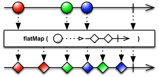

Author Pablo Perez Garcia 

# ReactiveX

Marble diagrams are not clear enough?.

Here we cover with some practical examples, the most common use of the ReactiveX platform for Java.

This project it´s just a complement to play around and put in practice what I´ve learned in the platform.

To reference to the real documentation go here https://github.com/ReactiveX/RxJava/wiki

RxScala examples [here](https://github.com/politrons/reactiveScala)

### Observables

All the most common features of Observable

* **Contactable**

    
    * [HotObservable] (src/test/java/rx/observables/connectable/HotObservable.java)
 
* **Combining**

    
    * [ObservableChain] (src/test/java/rx/observables/combining/ObservableChain.java)
    * [ObservableConcat] (src/test/java/rx/observables/combining/ObservableConcat.java)
    * [ObservableMerge] (src/test/java/rx/observables/combining/ObservableMerge.java)
    * [ObservableZip] (src/test/java/rx/observables/combining/ObservableZip.java)
    * [ObservableSwitch] (src/test/java/rx/observables/combining/ObservableSwitch.java)

* **Creating**

    
    * [ObservableDefer] (src/test/java/rx/observables/creating/ObservableDefer.java)
    * [ObservableInterval] (src/test/java/rx/observables/creating/ObservableInterval.java)
    * [ObservableSubscription] (src/test/java/rx/observables/creating/ObservableSubscription.java)
    
* **Filtering**

    
    * [ObservableDebounce] (src/test/java/rx/observables/filtering/ObservableDebounce.java)
    * [ObservableDistinct] (src/test/java/rx/observables/filtering/ObservableDistinct.java)
    * [ObservableSkip] (src/test/java/rx/observables/filtering/ObservableSkip.java)
    * [ObservableTake] (src/test/java/rx/observables/filtering/ObservableTake.java)

* **Transforming**

    
    * [ObservableMap] (src/test/java/rx/observables/transforming/ObservableMap.java)
    * [ObservableFlatMap] (src/test/java/rx/observables/transforming/ObservableFlatMap.java)
    * [ObservableGroupBy] (src/test/java/rx/observables/transforming/ObservableGroupBy.java)
    * [ObservableScan] (src/test/java/rx/observables/transforming/ObservableScan.java)
    * [ObservableBuffer] (src/test/java/rx/observables/transforming/ObservableBuffer.java)
    * [ObservableWindow] (src/test/java/rx/observables/transforming/ObservableWindow.java)
    * [ObservableCompose] (src/test/java/rx/observables/transforming/ObservableCompose.java)

* **Scheduler**

    
    * [ObservableAsynchronous] (src/test/java/rx/observables/scheduler/ObservableAsynchronous.java)
    
* **Errors**

    
    * [ObservableExceptions] (src/test/java/rx/observables/errors/ObservableExceptions.java)
        
* **Utils**
    * [ObservableAmbConditional] (src/test/java/rx/observables/ObservableAmbConditional.java)
    * [ObservableCache] (src/test/java/rx/observables/ObservableCache.java)
    * [ObservableToBlocking] (src/test/java/rx/observables/ObservableToBlocking.java)

### Single

An Observable that just emit 1 item through the pipeline.

* [SingleFeatures] (src/test/java/rx/single/SingleFeatures.java)

### Relay

A subject which subscribe observers and keep the pipeline open all the time.

* [Relay] (src/test/java/rx/relay/Relay.java)

### Observer V Iterator Pattern

An explanation, comparative and benchmark between these two patterns.

* [ObserverVsIterator] (src/test/java/rx/utils/ObserverVsIterator.java)

### Java 8

The Java 8 Stream API with examples of most useful operators.

* [Stream] (src/test/java/stream/StreamUtils.java)

The Java 8 Functions with particle examples of how to use it.

* [Functions] (src/test/java/stream/Functions.java)

